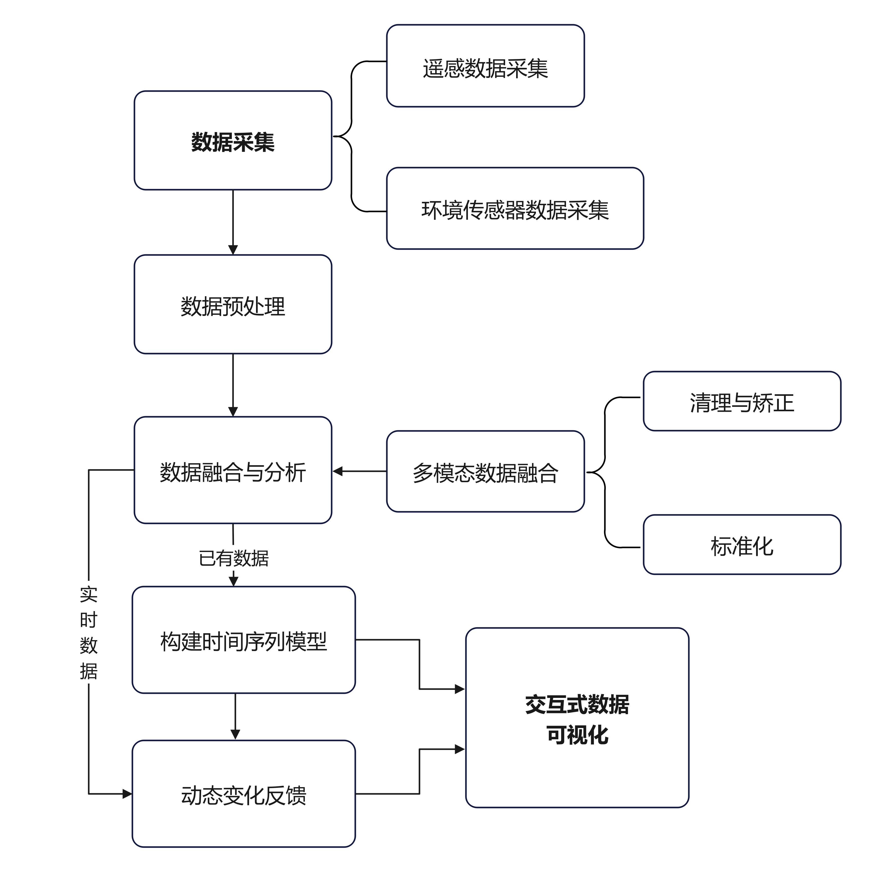
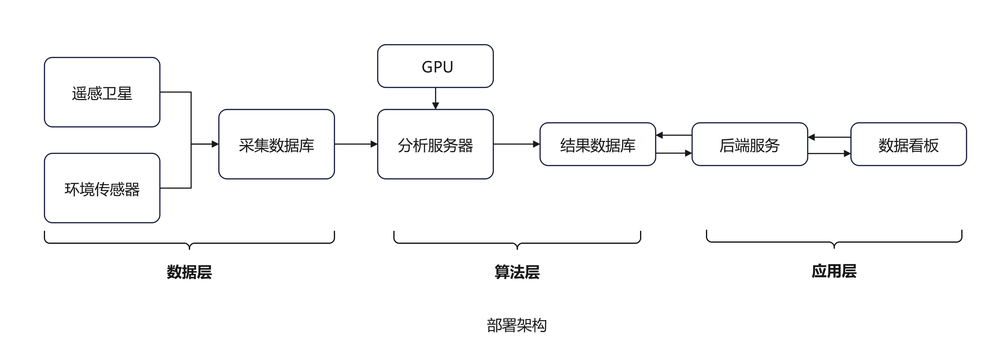

# 1. 大创

## 1.1. 本周分工情况

- 孙依轩：修改项目申报表文本，了解“配准”相关的知识和项目
- 肖荟萍：修改项目申报表文本，画项目流程图
- 李宸希：搜索有关湿地的图像，了解与遥感湿地保护相关的项目，找有关“配准”的项目

## 1.2. 项目进展

- 项目申报表修改完成
- 项目相关的仓库
  - [一种基于深度的多描述符特征提取方法：SAR 图像配准的应用(A Deep-Based Approach for Multi-Descriptor Feature Extraction: Applications on SAR Image Registration)](https://github.com/ShowStopperTheSecond/r2d2_for_sar)
- 项目相关的图

.jpg)
.jpg)
.jpg)
.jpg)

## 1.3. 目前的问题

1. 分析湿地遥感图像对其进行配准的方法，正在看关于配准的项目
2. 提取有时序的湿地遥感图像数据集，目前正在找有关数据集
3. 需要找一个简单的湿地实例分割的项目，复现之后，再对其进行配准的扩展

## 1.4. 项目申报表

「*大创项目在12月底提交立项申请*」

### 1.4.1. 一、项目简介（200字以内）（199字）

湿地作为重要的生态系统，在维护生物多样性、调节气候方面具有关键作用。然而，目前全球湿地正面临面积缩减和功能退化等严峻挑战，极端天气频发，有效的湿地监测与保护已成为环境保护领域的紧迫任务。

本项目旨在研究开发湿地变化监测系统，结合多时相遥感图像和环境传感器数据，实现对湿地重要参数的动态监测，精准预警环境污染。项目突破了现有监测平台只能提供单一时刻分析的局限，并最终以易于分析的可视化形式呈现。

### 1.4.2. 二、项目相关研究现状及发展动态（不少于200字）（869字）

湿地遥感监测利用遥感技术对湿地生态系统进行非侵入性、快速、高效的观测。目前，主要的方法包括光学遥感、雷达遥感和高光谱遥感等。这些技术能够获取湿地的空间分布、植被类型和水文特征等多种信息，为湿地保护提供重要的数据支持。然而，目前的遥感监测技术存在数据维度单一、技术集成度低、监测频率与时效性不足以及多源数据融合欠缺等问题，难以实现对湿地生态系统的全面、动态和实时监测，具体体现为：

- 传统遥感监测主要关注湿地的单时刻状态，缺乏对湿地变化趋势和动态过程的深入分析，难以刻画湿地生态系统的变化趋势。
- 遥感技术与地理信息系统（GIS）、人工智能等其他技术的融合程度不足，限制了数据的综合分析能力和应用深度。
- 受制于卫星过境时间、天气条件等因素，遥感监测的频率可能无法满足湿地动态变化的实时监测需求。这可能导致对关键湿地变化的滞后发现。
- 目前，遥感技术与其他技术（如地理信息系统、人工智能）之间的融合程度尚不充分，限制了对湿地生态系统的综合分析和全面监测。

近年来，湿地保护领域在技术应用和管理策略上取得了显著进展，湿地保护和监测技术逐渐向智能化、自动化方向发展。发展空间充足，但也仍存在需要优化的方面，如技术集成度、监测频率和多源数据融合方向。

我国在湿地保护方面已建设了多个重要的湿地生态站，这些生态站为长期监测和研究湿地生态系统提供了重要的平台。然而，当前的湿地生态站在数量和布局上仍存在层级结构不合理、监测指标体系不规范等问题，限制了国家层面湿地生态系统的全面监测和评估。此外，湿地遥感监测技术经历了从中低分辨率向高分辨率发展的过程，监测模型也由传统的模型驱动转向数据驱动方法，其应用范围从简单的湿地范围制图扩展到精细的湿地亚类及其内部地物识别，这为湿地监测技术的发展开辟了更多的应用场景和空间。基于这一发展趋势，当前湿地保护技术亟需更加注重数据的综合分析与应用，以提升监测的多维性，为湿地保护和管理提供更全面的决策依据。项目的研究方向和目标正契合这一需求，有望为湿地保护技术的发展提供新的思路和方法。

### 1.4.3. 三、项目实施的目的、意义（不少于200字）（420字）

湿地云盾项目将利用遥感图像分析与人工智能技术，全面提升湿地保护与环境监测能力。通过多时遥感图像分析算法，实现湿地面积、植被覆盖等动态变化的实时监测，提供精准的数据支持。在此基础上，结合数据融合技术，将遥感图像与环境传感器数据相结合，实现对湿地环境污染的高精度监测，为环境保护决策提供科学依据。同时融合多模态数据，分析湿地变化趋势并进行预测与预警，提前识别湿地退化与水域变化等问题，助力湿地保护与可持续发展。

本项目的实施具有重要的理论价值和现实意义。旨在填补现有湿地监测平台在长期跟踪和趋势预测方面的空白，推动湿地保护向更精确、高效的方向发展。通过多源数据融合和人工智能技术，显著提升湿地和环境污染监测的精度与时效性，为环境保护决策提供科学依据。同时，项目注重开发易用的监测系统，降低技术门槛，提升系统普及度，吸引更多非专业人员参与湿地保护。最终为生态环境保护提供前瞻性、系统化的技术支持，助力国家生态文明建设与可持续发展战略的实施。

### 1.4.4. 四、项目研究内容和拟解决的关键问题(300+)（1448字）

湿地云盾项目的研究主要在于湿地变化监测系统和算法的设计与实现上，通过开发多时相遥感图像动态分析技术、环境传感器数据融合与多模态分析、湿地动态监测与趋势预测算法，设计易操作的监测系统与交互式数据可视化工具，并结合分析结果提供湿地保护与恢复建议，全面提升湿地生态变化监测与管理的科学性、精准性与实用性。具体内容如下：

1. 多时相遥感图像动态分析技术研发：开发基于深度学习的多时相遥感图像分析算法，实现湿地范围、植被类型、水文变化等重要参数的自动提取与动态监测。研究影像配准、图像分割、变化检测等关键技术，突破传统单时刻分析的局限，全面刻画湿地生态系统的变化过程。

2. 环境传感器数据融合与多模态分析：结合遥感图像与湿地内环境传感器（如水质监测、气象传感器）的实时数据，通过数据融合技术，建立多模态湿地环境变化模型。以湿地污染、退化等问题为核心，提升监测的准确性和全面性。

3. 湿地动态监测与趋势预测算法开发：基于时间序列分析与机器学习技术，构建湿地变化的动态监测和趋势预测模型。实现对湿地面积缩减、植被覆盖变化及水质退化等问题的提前预警，为湿地管理和决策提供支持。

4. 湿地变化监测系统设计与实现：设计开发一套集成化、易操作的湿地变化监测系统，覆盖数据采集、处理、分析和展示的完整流程。系统具备高自动化、低门槛的特点，支持动态更新、实时监测和多用户协同使用，降低非专业人员使用系统的难度。

5. 数据可视化与结果展示:开发交互式数据可视化工具，将监测数据以地图、动态图表和其他直观形式进行展示。优化结果呈现方式，使用户能够快速理解湿地变化的时空趋势及其生态影响，促进数据应用价值的最大化。

6. 湿地生态变化的自然语言建议:结合多源数据分析结果，估计湿地变化的主要驱动因素，评估湿地生态功能的动态变化。从而给出湿地保护与恢复的决策提议，为湿地资源的可持续管理提供科学依据。

本项目的研究旨在突破湿地监测领域现有技术的局限，聚焦数据获取、分析、融合和可视化四个关键过程，拟解决的关键问题包括以下内容：

1. 数据读取
   我们将设计基于深度学习的人工智能驱动湿地数据提取方法，通过多时相遥感图像的输入，自动提取湿地范围、植被类型和水文特征等关键参数。同时研究针对多时相遥感图像的变化检测技术，开发湿地动态变化监测算法，精准监测湿地面积缩减、植被覆盖变化等动态过程，实现湿地变化的实时监控与精确分析。

2. 数据分析
   本项目欲将湿地变化数据自动转换为自然语言描述的方法，使监测结果不仅能够可视化展示，还能以易于理解的文字形式呈现，从而提升湿地监测成果的可读性和传播范围。并通过分析湿地变化数据与决策建议的对应关系，构建从数据到建议的生成路径，提供智能化的分析工具，为湿地保护决策提供科学依据。

3. 数据融合
   本项目将开发环境传感器数据与遥感数据的融合分析技术，构建多模态湿地变化监测模型，旨在实现对湿地污染、气候影响和生态退化等复杂问题的全景式评估。并研究不同数据模态之间的转换方法，确保输出结果与用户需求的精准匹配，从而提高数据融合的效率和准确性。

4. 数据可视化
   需设计实时更新的湿地监测可视化工具，采用动态、交互式地图和动态图表等形式直观呈现数据，帮助用户快速洞察湿地变化的时空分布和演化趋势。结合用户需求优化结果展示的易用性，简化复杂数据的展示形式，降低技术门槛，使非专业用户也能轻松获取关键监测信息。

### 1.4.5. 五、项目研究与实施的基础条件（不少于300字）（437字）

随着全球遥感技术的进步，大量高质量的遥感影像数据被公开和共享，如美国地质调查局的Landsat系列、欧洲空间局的Sentinel系列和我国的高分辨率对地观测系统等，这为湿地监测提供了丰富的数据源。秦岭地区作为我国重要的生态屏障和生物多样性保护区，利用其公开的湿地数据集进行研究，具有重要的科学价值和实践意义。此外，环境传感器技术的进步使得湿地环境数据（如水质、气象、土壤湿度等）得以实时采集，与遥感数据结合，能够实现对湿地生态系统的多维度监测。深度学习算法在图像识别、目标检测和变化检测等领域的应用，进一步提升了湿地变化自动检测的效率和准确性。政策上的支持也为湿地保护提供了推动力，国家对生态环境保护的重视推动了湿地监测与保护的工作。与此同时，云计算和大数据平台的发展为大规模遥感数据的存储、处理和分析提供了强有力的技术支撑。因此，本项目基于先进的遥感数据、多源数据融合技术、深度学习算法及云计算平台，将能够实现湿地变化的精准监测，并在国内外湿地保护领域具有广阔的应用前景。

### 1.4.6. 六、项目实施方案（不少于300字）（1046字）

“湿地云盾”项目将依次通过数据集构建、自动化湿地遥感图像分析模型研究、多时相变化检测算法的研发、湿地变化监测系统的设计与开发、遥感数据与环境传感器数据的融合、湿地变化数据与决策建议的关联这几个步骤，实现湿地变化监测系统的全面设计与开发。具体方案如下：

1. 数据集构建：通过检索和筛选全球及国内公开的遥感数据集，获取涵盖目标湿地区域（如秦岭地区）的高质量、多时相遥感图像。对收集的遥感数据进行辐射校正、大气校正、几何校正和图像配准，确保数据的准确性和一致性。针对数据缺失或时间序列不完整的问题，探索融合不同卫星平台和传感器的数据，建立完整的湿地变化监测数据基础。

2. 自动化湿地遥感图像分析模型研究：开发基于深度学习的图像分割模型，自动提取湿地的空间范围，识别湿地边界和形态特征。利用遥感影像的光谱特征，建立植被指数模型，分析湿地植被的种类、密度和健康状况。研究水体检测算法，提取湿地水文特征，包括水域面积、水质参数（如悬浮物、藻类分布）等。

3. 多时相变化检测算法的研发：针对多时相遥感影像，设计序列分析方法，研究时间序列变化检测算法，识别湿地在不同时间节点的变化。开发能够实时更新的异常检测模型，捕捉湿地面积变化、植被退化、水文状况变化等动态信息，实现湿地动态变化的实时监测。建立变化阈值模型，对湿地变化进行识别和预警，辅助管理部门及时采取应对措施。

4. 湿地变化监测系统的设计与开发：规划系统的整体架构，包括数据层、算法层、应用层和展示层，确保系统的模块化和可扩展性。设计友好的操作界面，支持用户便捷地访问和操作系统功能，降低使用门槛。集成数据处理、变化分析、结果展示等功能，支持动态更新、实时监测和多用户协同使用，满足不同用户的需求。

5. 遥感数据与环境传感器数据的融合：探索空间、时间和属性等多维度的数据融合方法，整合遥感影像与环境传感器数据（如水质、气象、土壤湿度等）。建立多源数据融合模型，分析湿地环境污染的空间分布和变化趋势，提高监测的准确性。利用融合后的数据，开展湿地生态环境的综合评估，识别污染源和受影响区域，为环境治理提供科学依据。

6. 湿地变化数据与决策建议的关联：研究将湿地变化检测结果转化为自然语言描述的方法，生成易于理解的报告和摘要。构建从湿地变化数据到管理建议的关联模型，自动生成针对性的决策建议，辅助管理者制定科学的保护和治理措施。建立湿地管理与保护的知识库，结合历史数据和专家经验，丰富决策建议的内容和准确性。

### 1.4.7. 七、项目创新点及特色（不少于300字）（1140字）

本项目在湿地监测与保护领域提出了一系列创新点和特色，旨在克服现有技术的局限性，提供更高效、更精准的湿地监测解决方案。主要创新点和特色体现在以下几个方面：

1. 基于人工智能的自动化湿地变化检测算法，提升监测精度和效率

   - 创新点：引入深度学习和机器学习技术，开发了适用于湿地变化检测的自动化算法。这些算法能够从海量的遥感影像中高效、准确地提取湿地变化信息，如湿地面积缩减、植被退化等。
   - 特色：相比传统的手工解译或基于规则的算法，人工智能算法具有更强的适应性和泛化能力，能够处理复杂的地表覆盖类型和变化模式，显著提升了监测的精度和效率，减少了人力和时间成本。

2. 多时相遥感影像与环境传感器数据的深度融合，实现湿地动态变化的精准监测

   - 创新点：传统湿地监测多依赖于单一时刻的遥感影像，缺乏对湿地长期动态变化的连续监测。本项目突破这一局限，采用多时相遥感影像，结合湿地内部环境传感器的数据，实现对湿地生态系统的动态、连续监测。通过数据融合技术，构建了一个多源、多维度的数据分析框架。
   - 特色：这种融合不仅提供了湿地表层的变化信息，还深入到湿地内部环境因素的变化，全面评估湿地的健康状况。通过对湿地面积、植被覆盖、水文特征等多种参数的连续监测，提升了监测的时效性和准确性，为湿地保护提供了高质量的数据支持。

3. 多源数据融合分析，全面评估湿地生态环境

   - 创新点：突破单一数据源的限制，将遥感数据与环境传感器数据（如水质、气象、土壤湿度等）进行深度融合，开展多维度的湿地生态环境评估。
   - 特色：这种多源数据融合的方法，能够全面捕捉湿地生态系统的复杂变化，识别潜在的环境问题，为制定综合性的保护策略提供了科学依据。

4. 监测结果与可行建议的智能关联，为决策提供科学依据

   - 创新点：研究了湿地变化数据与管理措施之间的对应关系，建立了从监测结果到可行建议的自动生成模型。系统能够根据湿地的具体变化情况，提供针对性的管理和保护建议。
   - 特色：这一功能为湿地管理部门提供了科学、快捷的决策支持工具，提升了管理效率。通过智能化的建议生成，帮助管理者及时采取有效措施，防止湿地进一步退化。

5. 交互式数据可视化技术，提升结果展示的直观性和易用性

   - 创新点：开发了先进的可视化工具，将监测数据以地图、动态图表、三维模型等形式直观展示。用户可以通过交互式界面，灵活查看不同时间、空间尺度的湿地变化信息。
   - 特色：提升了用户体验，使监测结果更加生动、易于理解。无论是专业人士还是公众，都能通过可视化平台直观地感受湿地的变化过程，增强了信息的传达效果。

### 1.4.8. 八、已有基础（1174字）

「*包括与本项目有关的研究积累和已取得的成绩、学校可以提供的条件、尚缺少的条件及解决方法*」

项目建立在扎实的技术基础和科研积累之上，同时依托学校的学术优势和科研条件，为项目的顺利实施奠定了良好的基础条件：

1. 与本项目有关的研究积累

   团队成员有人工智能相关技术的技术基础，并在趋势预测和自动预警模型构建方面探讨过实用的技术路径。同时，本团队在数据可视化技术上也有一定的经验，曾开发过交互式数据展示平台，支持动态数据的展示和分析。相关技术可迁移应用于湿地监测结果的实时展示和趋势分析，为项目的可视化系统开发奠定了基础。此外，本项目指导教师杨育婷深耕人工智能核心算法、机器视觉及遥感影像解译领域，成果发表于IEEE TGRS等国际权威期刊。指导老师李玲玲在高分辨遥感影像解译与优化学习方面造诣深厚，主持多项国家级项目，提出了面向遥感影像的复数多尺度几何分析算法和多模态可解释性模型，在TNNLS等顶级期刊发表论文100余篇。

2. 学校可以提供的条件

   西安电子科技大学具备优秀的科研环境，多个研究团队在机器学习、时序数据分析及图像处理领域具有深厚的学术积累，并取得了一系列高水平研究成果。同时，本校提供高性能计算集群等先进计算资源，能够满足遥感图像与环境数据的可行性验证需求。除此之外，学校的跨学科研究、面向应用研究的氛围，促进了遥感技术与人工智能技术的融合，人工智能学院获批“陕西省遥感大数据应用工程技术研究中心”，充分发挥遥感人工智能创新大模型的优势，为本项目关键技术开发提供良好的学术土壤和驱动力。

3. 尚缺少的条件及解决方法

   尽管有丰富的研究积累和有力的支持，本项目仍面临着通过利用大规模遥感数据集与分布式计算架构提升数据处理效率，构建时序分析模型实现湿地动态监测与预警，并优化多源数据融合技术，精准整合环境传感器与遥感数据，提供高效高精度的湿地监测方案等复杂问题，具体表现为：

   - 大规模遥感图像数据集：本项目需要考虑处理的遥感数据量大，涵盖多时相、高分辨率的影像，需要充分利用现有的公开遥感数据集，减少数据采集成本。此外，需要通过采用分布式计算架构，建立云计算集群，提高数据的处理效率和数据呈现的时效性。
   - 时序分析模型的建立：项目需要建立湿地变化的时序分析模型，以实现对湿地动态变化的连续监测。团队需要通过深入研究时间序列分析和机器学习技术，构建适用于湿地监测的时序分析模型，从而实现对湿地变化趋势的动态时序预测和预警。
   - 多源数据融合的技术优化：环境传感器数据与遥感数据的精准融合是面临的技术难题之一。项目将通过研究 先进的数据融合算法，结合人工智能技术，确保不同模态数据的高精度整合与分析。

综上所述，项目将在已有积累、学校支持和外部资源整合的基础上，将通过技术创新和资源优化，解决现有条件下的限制，为项目的顺利实施提供有力保障。

### 1.4.9. 九、项目研究进度安排及各阶段预期成果

「*本栏内容为中期检查及结题答辩重要参考，进度无明确时间节点和明确预期成果的，拒收拒评*」

1. 主要进度安排

   - 2024 年 12 月 01 日 - 2024 年 12 月 25 日，规划研究路径，撰写项目需求和目标，提交项目申报表。
   - 2024 年 12 月 25 日 - 2025 年 05 月 01 日，推进项目研究，完成一部分关键技术和算法研究，初步验证技术可行性。
   - 2025 年 05 月 01 日 - 2025 年 06 月 01 日，提交中期检查材料和报告。
   - 2025 年 06 月 01 日 - 2026 年 05 月 01 日，深入开展项目研究，完成系统设计和开发，成功部署湿地监测系统。
   - 2026 年 05 月 01 日 - 2026 年 05 月 29 日，归纳整理项目研究成果，准备结题材料和报告，提交结题报告。

2. 项目预期成果

   - 有公开发表论文、专利（发明专利被受理、实用新型专利获得授权）
   - 部署到实际应用场景中，能成功在实际环境中正常运作，取得预期效果，并实现一定的经济效益
